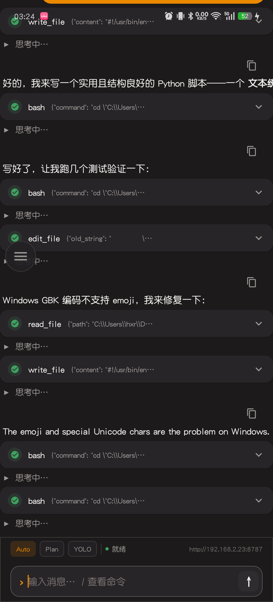
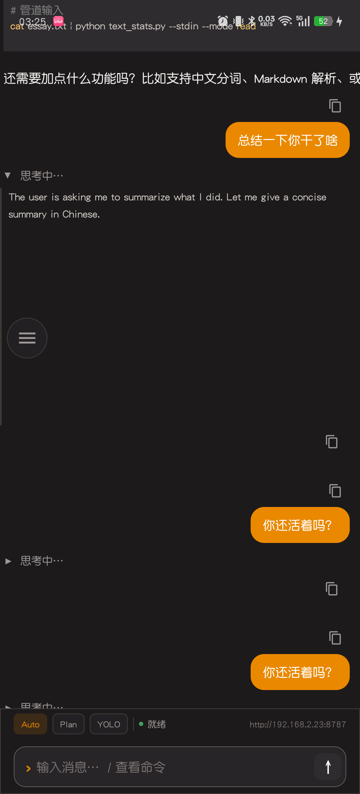
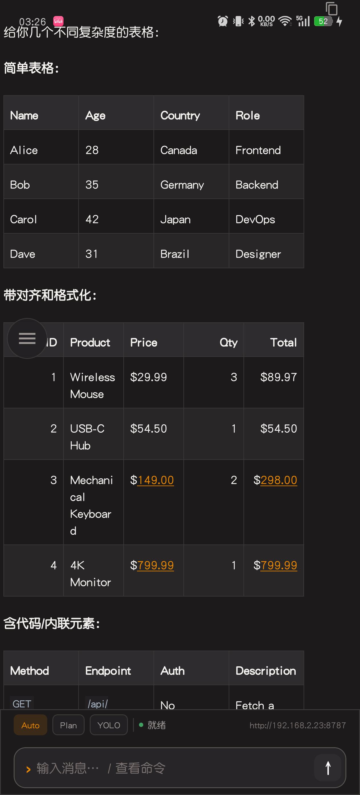
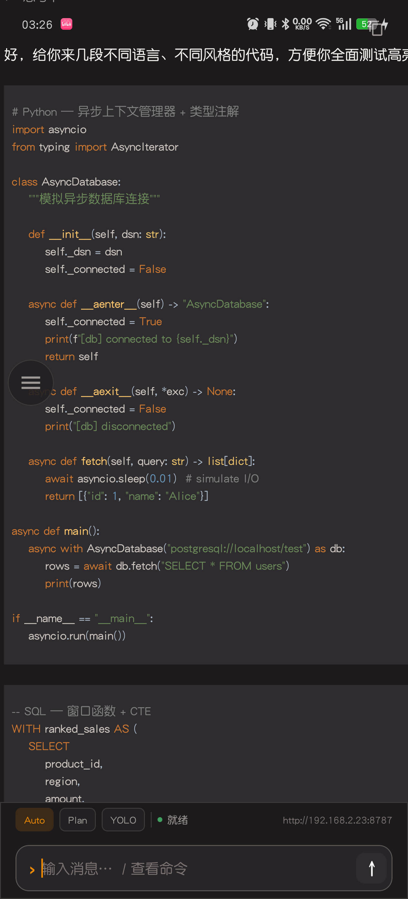
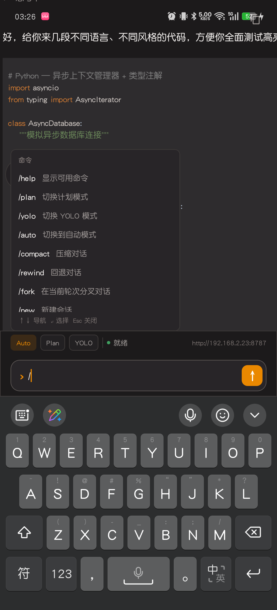
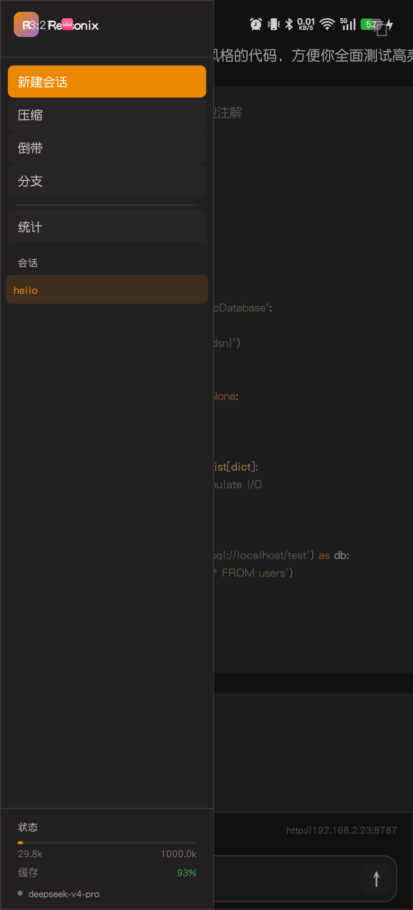
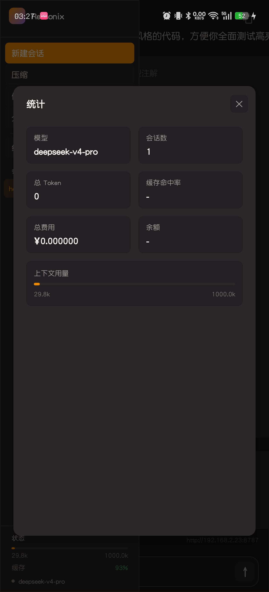
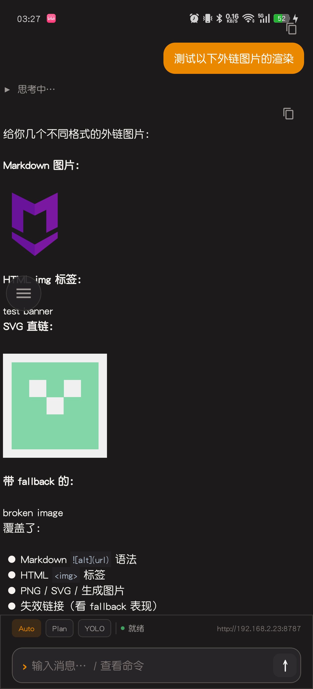

<div align="center">


# Reasonix Android

**🤖 Reasonix 的 Android 原生客户端 · Kotlin + Jetpack Compose · 支持 Basic Auth / HTTPS**

[](https://github.com/xiwangone/reasonix-android/actions/workflows/build.yml)
[](https://github.com/xiwangone/reasonix-android)
[](LICENSE)
[](https://github.com/xiwangone/reasonix-android/commits/master)

[**English**](README_EN.md) | **简体中文**

</div>

---

## 🚨 重要声明

| 项目 | 链接 | 说明 |
|------|------|------|
| 🔵 **DeepSeek-Reasonix（协议上游）** | https://github.com/esengine/DeepSeek-Reasonix | **后端服务与协议定义，本客户端遵循其协议** |
| 🟢 **DeepSeek-Reasonix-android（客户端原版）** | https://github.com/hxr66666/DeepSeek-Reasonix-android | **原版 Fork，本仓库基于此（MIT）** |
| 🟡 **本仓库（独立维护版）** | https://github.com/xiwangone/reasonix-android | **致谢原作者前提下独立开发，不依赖上游更新** |

> ### ⚠️ 使用须知
>
> - **❌ 非官方发布** — 不是 esengine 或 hxr66666 官方发布
> - ✅ 代码来源可信（MIT 许可），已在 LICENSE 注明原作者致谢
> - 💡 如遇问题，可参考 [原版仓库](https://github.com/hxr66666/DeepSeek-Reasonix-android) 或 [协议上游](https://github.com/esengine/DeepSeek-Reasonix)

---

## 简介

[DeepSeek-Reasonix](https://github.com/esengine/DeepSeek-Reasonix) 的 **Android 原生客户端**，基于 Web 前端协议完整重写，使用 **Kotlin + Jetpack Compose + Markwon** 构建。非 WebView 套壳，Compose 声明式布局自动适配移动端。

**特色**：SSE 流式对话、推理过程实时渲染、工具调用卡片、Rewind 回退、Slash 命令、中英双语。

---

## 功能

| 模块 | 说明 |
|------|------|
| 💬 **AI 对话** | 完整的 SSE 流式通信，支持实时渲染推理过程、工具调用卡片、费用统计 |
| 📝 **Markdown 渲染** | Markwon 原生引擎，支持代码高亮（Prism4j）、表格、图片、HTML、任务列表 |
| 🧠 **推理展示** | 可折叠的 reasoning block，展示 AI 思考过程 |
| 🔧 **工具卡片** | 实时展示工具调用——名称、参数、输出，支持折叠展开 |
| ⏪ **Rewind 回退** | 回退到历史检查点，支持多种作用域（代码+对话 / 仅对话 / 仅代码 / 分叉） |
| 📦 **会话管理** | 新建 / 恢复 / 切换会话，会话列表 |
| ⌨️ **Slash 命令** | `/compact` `/new` `/resume` `/rewind` `/model` `/mcp` `/help` 等 |
| 🔐 **Basic Auth** | 连接支持用户名/密码认证（2026-08-04 新增，可选填，兼容无认证直连） |
| 🌐 **HTTP/HTTPS** | 协议可切换，HTTPS 默认端口 443（2026-08-04 新增） |
| 🌙 **暗色主题** | Material 3 暗色主题，与 Web 端一致的 OKLCH 色彩 |
| 🌐 **国际化** | 中 / 英双语 |

---

## 截图

<p align="center">
  
  
  
  
  
  
  
  
</p>

---

## 技术栈

| 层面 | 技术 |
|------|------|
| **语言** | Kotlin 2.1 |
| **UI** | Jetpack Compose (Material 3, BOM 2026.02) |
| **架构** | MVVM (ViewModel + Repository) |
| **网络** | OkHttp 4.12 + OkHttp-SSE |
| **序列化** | Gson 2.10 |
| **Markdown** | Markwon 4.6（core + syntax-highlight + html + image + tables + tasklist + strikethrough + linkify） |
| **语法高亮** | Prism4j 2.0 |
| **图片加载** | Coil 2.7 / Glide 4.16 / Picasso 2.8 |
| **协程** | Kotlinx Coroutines 1.7 |
| **构建** | Gradle 9.3 + AGP 9.1 + Version Catalog |

### 兼容性

- **最低**: Android 6.0 (API 23)
- **目标**: Android 14 (API 36)
- **编译**: Android 15 (API 37)

---

## 快速开始

### 前置条件

- **JDK 17+**
- **Android Studio** (最新稳定版)
- **Android SDK** (API 37)

### 构建 & 运行

```bash
# 1. 克隆仓库
git clone https://github.com/xiwangone/reasonix-android.git
cd reasonix-android

# 2. 构建 Debug APK
./gradlew assembleDebug

# 3. 安装到设备
adb install app/build/outputs/apk/debug/app-debug.apk
```

或在 Android Studio 中直接打开项目，点击 Run。

### 连接后端

客户端需要连接到 Reasonix 后端服务才能正常工作。

```bash
# 启动 Reasonix 服务（见协议上游 DeepSeek-Reasonix）
reasonix serve --addr "0.0.0.0:8787"
```

打开 App → 服务器配置页：

| 配置项 | 说明 |
|--------|------|
| 协议 | HTTP / HTTPS（HTTPS 默认端口 443） |
| 地址 | 服务器 IP 或域名 |
| 端口 | 默认 8920（HTTP）/ 443（HTTPS），可改 |
| 用户名/密码 | 可选；Basic Auth 认证时填写，留空兼容无认证直连 |

---

## 项目结构

```
reasonix-android/
├── app/
│   ├── build.gradle.kts          # 应用构建配置
│   └── src/main/
│       ├── AndroidManifest.xml
│       ├── java/com/reasonix/deepseek_reasonix_android/
│       │   ├── MainActivity.kt
│       │   ├── data/
│       │   │   ├── ServerConfigStore.kt        # 配置持久化（含凭据/协议）
│       │   │   ├── api/
│       │   │   │   ├── ReasonixApi.kt          # REST API（Basic Auth）
│       │   │   │   └── ReasonixSseClient.kt    # SSE 流式客户端（Basic Auth）
│       │   │   ├── model/Models.kt             # 数据模型
│       │   │   └── repository/ChatRepository.kt
│       │   └── ui/
│       │       ├── screen/
│       │       │   ├── ChatScreen.kt           # 聊天主界面
│       │       │   └── ServerConfigScreen.kt   # 服务器配置（协议/凭据）
│       │       ├── components/
│       │       │   ├── ChatMessage.kt          # 消息气泡
│       │       │   ├── MarkdownRenderer.kt     # Markwon 渲染器
│       │       │   ├── MessageList.kt          # 消息列表
│       │       │   ├── ReasoningBlock.kt       # 推理块
│       │       │   ├── RewindPickerDialog.kt   # 回退选择器
│       │       │   ├── SlashMenu.kt            # Slash 命令菜单
│       │       │   ├── StatsDialog.kt          # 统计弹窗
│       │       │   ├── ToolCard.kt             # 工具调用卡片
│       │       │   └── WelcomeScreen.kt        # 欢迎页
│       │       ├── theme/
│       │       └── viewmodel/ChatViewModel.kt  # 聊天 ViewModel
│       └── res/
│           ├── drawable/logo.png               # 应用 Logo (720×720)
│           └── mipmap-*/                        # 启动图标
├── gradle/
│   └── libs.versions.toml                      # Version Catalog
├── settings.gradle.kts
└── build.gradle.kts
```

---

## CI/CD

本项目使用 **GitHub Actions** 自动构建。每次 push 到 `master` 分支或发起 Pull Request 时触发：

- ✅ 编译检查
- ✅ Debug APK 构建
- ✅ Release APK 构建
- ✅ 上传 APK 到 Actions Artifacts

工作流配置见 [`.github/workflows/build.yml`](.github/workflows/build.yml)。

构建状态：[](https://github.com/xiwangone/reasonix-android/actions/workflows/build.yml)

---

## 与 Web 端的关系

```
┌─────────────────────────────────────────┐
│              Reasonix 后端               │
│   POST /submit   GET /events (SSE)      │
│   POST /approve  POST /rewind           │
│   GET /sessions  GET /history           │
└──────────┬───────────────┬──────────────┘
           │               │
           ▼               ▼
┌──────────────────┐  ┌──────────────────┐
│  Web 前端（参考） │  │  Android 客户端   │
│  (官方 index.html)│  │  (本仓库)        │
└──────────────────┘  └──────────────────┘
```

Android 端完全遵循 [DeepSeek-Reasonix](https://github.com/esengine/DeepSeek-Reasonix) 定义的后端协议（SSE 流式消息格式、工具调用结构、rewind 语义等），提供与 Web 端一致的 AI 编码助手体验。

---

## License

MIT — 详见 [LICENSE](LICENSE)。

**致谢**：本仓库 fork 自 [hxr66666/DeepSeek-Reasonix-android](https://github.com/hxr66666/DeepSeek-Reasonix-android)（MIT），协议遵循 [esengine/DeepSeek-Reasonix](https://github.com/esengine/DeepSeek-Reasonix)。感谢原作者的工作。
